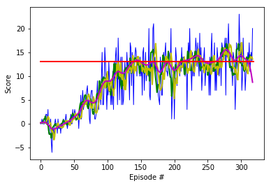

# Project report

## Learning algorithm

The employed learning algorithm is the standard Deep Q-Learning algorithm which was introduced in the article [Human-level control through deep reinforcement learning](https://storage.googleapis.com/deepmind-media/dqn/DQNNaturePaper.pdf) to solve [Markov Decision Processes](https://en.wikipedia.org/wiki/Markov_decision_process).

Due to the fact that we are using state vectors as an input and not image data we use a simple deep neural network instead of a convolutional neural network to determine the action-value function. The former consists of the following 5 layers coded into the model.py file:

- Fully connected layer - input: 37 (state size) output: 64
- Fully connected layer - input: 64 output: 32
- Fully connected layer - input: 32 output: 16
- Fully connected layer - input: 16 output: 8
- Fully connected layer - input: 8 output: 4 (action size)

We speficy the parameters used in the Deep Q-Learning algorithm (as in the dqn-function of the Navigation_solution.ipynb notebook):

- We set the number of episodes n_episodes to 3000. The number of episodes needed to solve the environment and reach a score of 13.0 is expected to be smaller.
- We set the maximum number of steps per episode max_t to 1000. Notice that the maximum number steps is actually hardcoded to 299 in the environment. 
- We start with an epsilion eps_start of 1.0.
- We end with an epsilion eps_end of 0.01.
- We set the epsilion decay rate eps_decay to 0.995.

Furthermore we give the parameters used in the dqn_agent.py file:

- The size of the replay buffer BUFFER_SIZE is set to 10^6.
- The mini batch size BATCH_SIZE is set to 64.
- The discount factor GAMMA for future rewards is set to 0.99.
- We set the value for soft update of target parameters TAU to 10^-3.
- The learning rate for the gradient descent LR is set to 5 * 10^-4.
- The update rate UPDATE_EVERY is set to 4 meaning that every 4 steps a gradient descent update at minibatch size is done.

## Results

With the above specifications we create Training run 1 and report the results.

First we give a plot of the scores over the episodes:

<p align="center">
  
</p>

Therein, we applied a simple and exponential moving average function at window sizes of 5  (green plot and yellow plot, respectively) overlaying the original data (blue). The red line indicates the threshold 13.0. More information on how to construct these moving averages in python can be found under the following links:
[Moving average in python](https://www.quora.com/How-do-I-perform-moving-average-in-Python) and [Exponential Moving average in python](https://www.youtube.com/watch?v=3y9GESSZmS0). Notice that the exponential moving average gives more emphasis to recent data than the simple version of it.

Then we list the average score every 100 episodes up to the point where the agent reaches a score equal or higher than 13.0: 

```
Episode 100	Average Score: 0.16
Episode 200	Average Score: 0.56
Episode 300	Average Score: 1.67
Episode 400	Average Score: 2.33
Episode 500	Average Score: 3.13
Episode 600	Average Score: 4.27
Episode 700	Average Score: 5.53
Episode 800	Average Score: 6.19
Episode 900	Average Score: 6.95
Episode 1000	Average Score: 7.73
Episode 1100	Average Score: 7.24
Episode 1200	Average Score: 8.52
Episode 1300	Average Score: 8.92
Episode 1400	Average Score: 10.42
Episode 1500	Average Score: 10.52
Episode 1600	Average Score: 10.62
Episode 1700	Average Score: 11.35
Episode 1800	Average Score: 11.57
Episode 1900	Average Score: 11.44
Episode 2000	Average Score: 11.97
Episode 2100	Average Score: 12.41
Episode 2200	Average Score: 12.42
Episode 2300	Average Score: 12.40
Episode 2374	Average Score: 13.06
Environment solved in 2274 episodes!	Average Score: 13.06
```

In the Training run 2, we used the epsilion decay rate 0.95 and followed an over greedier policy. We also set the theta parameter for the soft update to a slightly bigger value in the dqn_agent.py file.

The respective results are plotted and printed below:

<p align="center">
  
</p>

```
Episode 100	Average Score: 6.233	steps: 299	epsilon: 0.01408804957535735
Episode 200	Average Score: 12.677	steps: 299	epsilon: 0.01
Episode: 213	Average Score: 13.03	steps: 299	epsilon: 0.01
With the given parameters the environment is solved in 213 episodes. 	
The precise average score is 13.03 there.
```

## Possible extensions of the setting and future work

1. The hyperparameters should be optimized: For example, we could change the epsilon decay rate, the learning rate, the batch size and improve the network structure (more/less layers and units; overfitting could be tackled using dropout).


Further improvements of the Deep Q-Learning algorithm have been introduced in different articles:

2. [Prioritized Experience Replay](https://arxiv.org/abs/1511.05952): In this work the authors extend the idea of experience replay. They introduce a method which prioritizes experiences by replaying important transitions more often which accelerates the learning rate. 

3. [Double Q-learning](https://papers.nips.cc/paper/3964-double-q-learning): This method deals with the problem of overestimation, resulting from a positive bias that is introduced because Q-learning uses the maximum action value as an approximation for the maximum expected action value. In this work the authors introduce a double estimator method and show that this method performs well in cases were Q-learning tends to overestimation.

4. [Dueling Network Architectures for Deep Reinforcement Learning](https://arxiv.org/abs/1511.06581): In this paper, the authors present a neural network architecture with two branches leading to two estimators: one for the state value function _V(s)_ and one for the state-dependent action advantage function _A(s,a)_. This quantifies the improvement of taking one action compared to the rest. Calculating the value function independently allows the agent to learn the value of the state without the effect of choosing one action over the others. This becomes advantageous for environments were the effect of a single actions on states is not too extensive.

5. [Rainbow: Combining Improvements in Deep Reinforcement Learning](https://arxiv.org/abs/1710.02298): In this paper the authors discuss a combination of multiple possible improvements, such as Learning from multi-step bootstrap targets, Distributional DQN and Noisy DQN. It is shown that in many cases the combination of these methods leads to remarkable improvement in the performance. 

Image based Q-learning (original DQN article):

6. It is also possible to learn from pixels were the state of the system would be given by an 84 x 84 RGB image. This approach would require a convolutional deep Q-Network and an adequate  training should be performed on GPUs.
